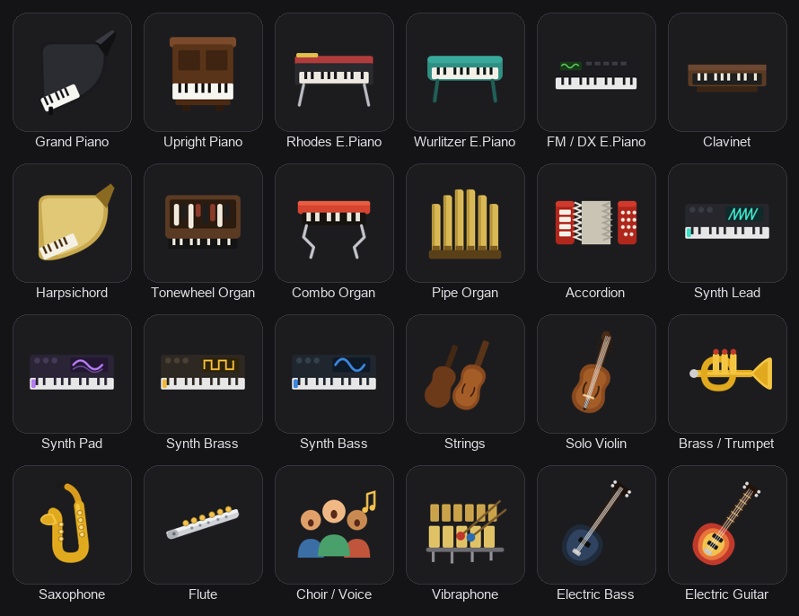

# Stage Keys — icon pack

Full-colour **sound-select** icons for the live keyboardist. One Stream Deck
key per stage-piano voice; recognise the sound at a glance under stage
lighting — no menu-diving, no patch numbers.



## Why a keyboardist needs this

A keyboard player rarely holds a single sound through a whole song. The verse
is on a **Rhodes**, the chorus opens up on a **synth pad**, the bridge moves to
**strings**, the solo jumps to **organ**, the intro was **acoustic piano**. In
the studio there's time; **live, the change has to land exactly on the beat,
without looking away from the keys**.

This pack turns a Stream Deck into a dedicated **sound selector** beside the
keyboard:

- **One physical key = one voice.** No scrolling through programs, no aiming at
  a tiny screen mid-phrase.
- **Read the sound by shape + colour, not text.** Under low light and stress you
  recognise an object (an organ, a sax, the red Rhodes rail) far faster than an
  abstract colour code or a patch name — which is exactly why these are
  full-colour illustrations, not monochrome silhouettes.
- **See the sound before you press it.** No landing on the wrong program at the
  wrong moment.

## What's inside (24 voices)

- **Pianos** — grand, upright, Rhodes, Wurlitzer, FM/DX
- **Clav & historic keys** — clavinet, harpsichord
- **Organs** — tonewheel (drawbars), combo (Vox), pipe, accordion
- **Synths** — lead, pad, brass, bass
- **Acoustic voices you switch to** — strings, solo violin, brass/trumpet,
  saxophone, flute, choir/voice, vibraphone
- **Rhythm section** — electric bass, electric guitar

## Build it

```sh
bin/sdicons build packs/stage-keys/src packs/stage-keys
# → dist/stage-keys-0.1.0.streamDeckIconPack
```

Licence: CC-BY-4.0 (see `license.txt`). Packaging for the Marketplace goes
through Elgato's Icon Pack Man — see [../../docs/publishing.md](../../docs/publishing.md).
